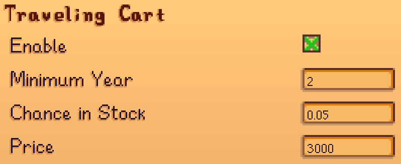
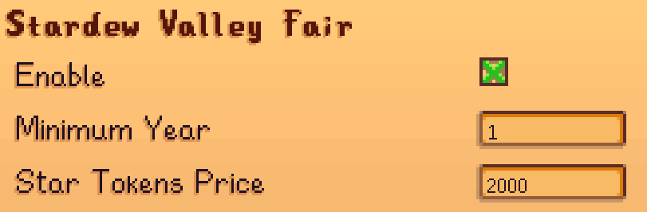
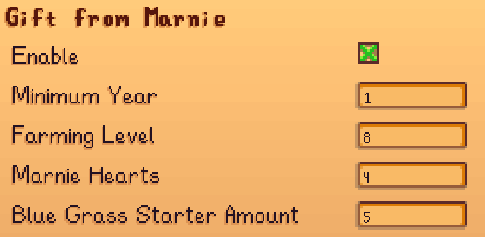

[Earlier Blue Grass](https://www.nexusmods.com/stardewvalley/mods/21135) adds three methods to obtain Blue Grass earlier in non-Meadowlands Farm. Each can be enabled or disabled. By default, the config file is set to disable all three. You should choose what you'd like to have in your game.

## Contents

* [Configuration](#configuration)
* [Compatibility](#compatibility)
* [FAQ](#faq)
* [Notes](#notes)

## Configuration
> [!IMPORTANT]
> [Generic Mod Config Menu](https://www.nexusmods.com/stardewvalley/mods/5098) is highly recommended.

By default, the config file is set to disable all three methods to obtain Blue Grass Starter. You should choose what you'd like to have in your game.
The mod config supports:

1. Traveling Cart  
You can set the minimum year, the chance Blue Grass Starter appearing in stock, and the price.

2. Stardew Valley Fair  
You can set the minimum year and the Star Tokens price.

3. Gift from Marnie  
You can set the minimum year, farming level requirement, Marnie's heart requirement, and amount of Blue Grass Starter given.

## Compatibility
- Stardew Valley Fair and Traveling Cart might not work if other mod patch the whole shop.
- Technically should work with [Stardew Valley Expanded](https://www.nexusmods.com/stardewvalley/mods/3753).

## FAQ
1. Can I use this mod in an ongoing save?  
Yes, you can. The mod effect will take place immediately after added and configured.
2. Can I use this mod in multiplayer?  
Yes, you can. Ideally with the mod installed and with same configuration on all players.

## Notes
- User @jumpstarted that asks for mod like this in Stardew Valley Discord server, leading to creation of this mod.